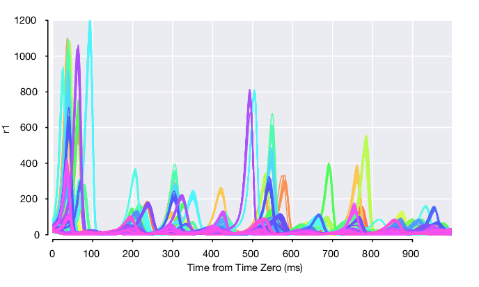

# LFADS Run Manager for Matlab Documentation

LFADS, or [Latent Factor Analysis via Dynamical Systems](https://www.nature.com/articles/s41592-018-0109-9), is a deep learning method to infer latent dynamics from single-trial neural spiking data. LFADS uses a nonlinear dynamical system (a recurrent neural network) to infer the dynamics underlying observed population activity and to extract ‘denoised’ single-trial firing rates from neural spiking data. Read the [LFADS manuscript](https://www.nature.com/articles/s41592-018-0109-9), published at Nature Methods, or the [LFADS pre-print](https://www.biorxiv.org/content/early/2017/06/20/152884) for more details.

LFADS Run Manager is a set of tools, written in Matlab with some accompanying Python code, that help organize, train, and analyze LFADS models. It accompanies the actual [Python+Tensorflow LFADS code](https://github.com/tensorflow/models/tree/master/research/lfads) which you will also need. We recommend using the Run Manager to organize your LFADS runs and to facilitate generation of the appropriate scripts to train your models and loading of the resulting model predictions for further analysis.

LFADS Run Manager was authored by [Daniel J O'Shea](http://djoshea.com) ([@djoshea](https://twitter.com/djoshea)) with contributions from [Chethan Pandarinath](http://snel.gatech.edu/) ([@chethan](https://twitter.com/chethan)), [David Sussillo](https://research.google.com/pubs/DavidSussillo.html) ([@SussilloDavid](https://twitter.com/sussillodavid)), and Reza Keshtkaran.


LFADS Run Manager helps you to:

* Organize your spiking neural datasets that will be used to train LFADS models.
* Setup a collection of training runs that vary in hyperparameter settings and the particular datasets included. The latter is particularly useful when generating _stitched_ multisession LFADS models.
* Generate shell scripts that will launch individual LFADS training runs *or* generate a script that will run the full set of runs somewhat in parallel by load balancing across GPUs and CPUs.
* Load the posterior means and parameters of individual LFADS models after each has finished training.
* Facilitate analysis, visualization, and comparison of the learned LFADS model generated factors, rates, etc.

The code within the run manager helps organize LFADS runs and facilitate analysis, but ultimately calls the Python+Tensorflow LFADS code available on [Github](https://github.com/tensorflow/models/tree/master/research/lfads).

To use the run manager, you will need to author a few functions that perform specific data processing steps that are specific to your datasets, such as extracting spike times. The goal of the run manager is to facilitate the above common tasks in a fairly dataset agnostic way, sparing you the need to hand-generate many one-off scripts to export data to HD5 in the right locations, drive the Tensorflow training, and to load the results from disk.

## Quick example

We'll walkthrough this example in more detail in this documentation, but to give you an idea of how the run manager works, here's the Matlab code you'd use to launch a couple of runs. Please note that you must follow the [installation instructions](install.md) first to follow along with this, and a more detailed walkthrough is available in [Setting up a single-session run](single-session.md).

```matlab
% Identify the datasets you'll be using (this will generate demo datasets)
LFADS.Utils.generateDemoDatasets('~/lorenz_example/datasets', 'nDatasets', 3);

% Add one that lives in ~/lorenz_example/datasets/dataset001.mat
dc = LorenzExperiment.DatasetCollection('~/lorenz_example/datasets');
dc.name = 'lorenz_example';
ds = LorenzExperiment.Dataset(dc, 'dataset001.mat'); % adds this dataset to the collection
dc.loadInfo; % loads dataset metadata

% Run a single model for each dataset, and one stitched run with all datasets
runRoot = '~/lorenz_example/runs';
rc = LorenzExperiment.RunCollection(runRoot, 'example', dc);

% run files will live at ~/lorenz_example/runs/example/

% Setup hyperparameters, 4 sets with number of factors swept through 2,4,6,8
par = LorenzExperiment.RunParams;
par.spikeBinMs = 2; % rebin the data at 2 ms
par.c_co_dim = 0; % no controller outputs --> no inputs to generator
par.c_batch_size = 150; % must be < 1/5 of the min trial count
par.c_gen_dim = 64; % number of units in generator RNN
par.c_ic_enc_dim = 64; % number of units in encoder RNN
par.c_learning_rate_stop = 1e-3; % we can stop really early for the demo
parSet = par.generateSweep('c_factors_dim', [2 4 6 8]);
rc.addParams(parSet);

% Setup which datasets are included in each run, here just the one
runName = dc.datasets(1).getSingleRunName(); % == 'single_dataset001'
rc.addRunSpec(LorenzExperiment.RunSpec(runName, dc, 1));

% Generate files needed for LFADS input on disk
rc.prepareForLFADS();

% Write a python script that will train all of the LFADS runs using a
% load-balancer against the available CPUs and GPUs
rc.writeShellScriptRunQueue('display', 0, 'virtualenv', 'tensorflow');
```

You've now setup a 1x 4 grid of LFADS runs, spanning 4 different hyperparameter settings all on the same individual dataset

```matlab
>> rc

rc =

LorenzExperiment.RunCollection "example" (4 runs total)
  Dataset Collection "lorenz_example" (1 datasets) in ~/lorenz_example/datasets
  Path: ~/lorenz_example/runs/example

  4 parameter settings
  [1 param_Z1-4Ne data_cq1HAe] LorenzExperiment.RunParams "" c_learning_rate_stop=0.001 c_batch_size=150 c_co_dim=0 c_ic_enc_dim=64 c_gen_dim=64 c_factors_dim=2
  [2 param_UEvXAB data_QcdNGf] LorenzExperiment.RunParams "" c_learning_rate_stop=0.001 c_batch_size=150 c_co_dim=0 c_ic_enc_dim=64 c_gen_dim=64 c_factors_dim=4
  [3 param_m8Dk5i data_y3K_k3] LorenzExperiment.RunParams "" c_learning_rate_stop=0.001 c_batch_size=150 c_co_dim=0 c_ic_enc_dim=64 c_gen_dim=64 c_factors_dim=6
  [4 param_YOs74u data_4MaTKO] LorenzExperiment.RunParams "" c_learning_rate_stop=0.001 c_batch_size=150 c_co_dim=0 c_ic_enc_dim=64 c_gen_dim=64 c_factors_dim=8

  1 run specifications
  [ 1] LorenzExperiment.RunSpec "single_dataset001" (1 datasets)

                                        name: 'example'
                                     comment: ''
                                    rootPath: '~/lorenz_example/runs'
                                     version: 20171107
                           datasetCollection: [1×1 LorenzExperiment.DatasetCollection]
                                        runs: [1×4 LorenzExperiment.Run]
                                      params: [4×1 LorenzExperiment.RunParams]
                                    runSpecs: [1×1 LorenzExperiment.RunSpec]
                                     nParams: 4
                                   nRunSpecs: 1
                                  nRunsTotal: 4
                                   nDatasets: 1
                                datasetNames: {'dataset001'}
                                    datasets: [1×1 LorenzExperiment.Dataset]
                                        path: '~/lorenz_example/runs/example'
                    pathsCommonDataForParams: {4×1 cell}
                              pathsForParams: {4×1 cell}
                  fileShellScriptTensorboard: '~/lorenz_example/runs/example/launch_tensorboard.sh'
                             fileSummaryText: '~/lorenz_example/runs/example/summary.txt'
                     fileShellScriptRunQueue: '~/lorenz_example/runs/example/run_lfadsqueue.py'
    fileShellScriptRunQueuePosteriorMeanOnly: '~/lorenz_example/runs/example/run_lfadsqueue_posteriorMeanOnly.py'
```

Then in your terminal, you can run:

```bash
python ~/lorenz_example/runs/example/run_lfadsqueue.py
```

This is a script which was automatically generated to fire off all the LFADS jobs in parallel, load-balancing as many as your system can handle across available GPUs. Then wait a few hours/days...

!!! tip "No module named `lfadsqueue` exception"
    If you run into an issue related to the module `lfadsqueue` not being found, be sure that you've added `lfads-run-manager/src` to your `PYTHONPATH` as described in the [installation instructions](install//#install-lfads).

As they finish, you can load and visualize the results easily in Matlab. Here we plot the inferred, single-trial firing rates of the first neuron:

```matlab
run = rc.findRuns('single_dataset001', 1);
pm = run.loadPosteriorMeans();
rates1 = squeeze(pm.rates(1, :, :)); % time x trials
...
```

The single-trial smoothed rates, colored by condition then look like:


